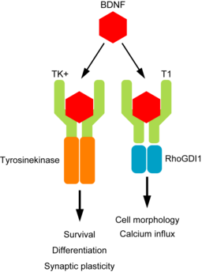
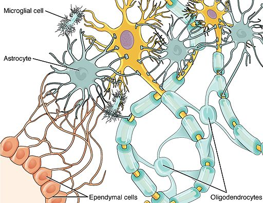

:::::::::::::::::::::::::::::::::::::: questions 

- What data are we using in this workshop?

::::::::::::::::::::::::::::::::::::::::::::::::

::::::::::::::::::::::::::::::::::::: objectives

- Describe the biological pathway that will be referenced throughout this workshop

::::::::::::::::::::::::::::::::::::::::::::::::

## Introduction to the data used in this workshop

This tutorial uses a well known and important signalling pathway in the **central nervous system (CNS)** 
to illustrate some genome browser tools and utility.

 

### BDNF and TrkB signalling

**Brain Derived Neurotrophic factor (BDNF)** protein is an important neurotrophin responsible for 
regulating many aspects of growth and development in different cells within the CNS. 
The *NTRK2* gene encodes the **TrkB protein**, which
is an important receptor that binds extracellular BDNF and propagates the intracellular 
signalling response via a tyrosine kinase. 

The NTRK2 gene expresses a number of different transcript variants in different cell types. 
The most well studied of these is the full length TrkB receptor referred to as **TrkB**, 
which is mainly expressed in neuronal cell types. The other transcript variants all 
express the same exons encoding the extracellular domain of the receptor 
(shown in green in the figure below) but have truncated intracellular domains, 
which do not include the tyrosine kinase domain and thus activate different signalling 
pathways upon binding to BDNF. None of these truncated protein products have been well studied, 
but the most highly expressed receptor variant is known as **TrkB-T1**, and is known to be highly expressed in astrocytes.

Since the transcript variants are differently expressed in different cell types within the CNS, 
the *NTRK2* gene is a very useful example for exploring cell type specific transcript expression in available public data.

 

### Major CNS cell types

- Neuron (yellow)
- Astrocyte
- Oligodendrocyte
- Microglia
- Ependymal

 

 

::::::::::::::::::::::::::::::::::::: keypoints 

- The *NTRK2* gene is a useful example for exploring cell-type specific transcript expression.

::::::::::::::::::::::::::::::::::::::::::::::::
