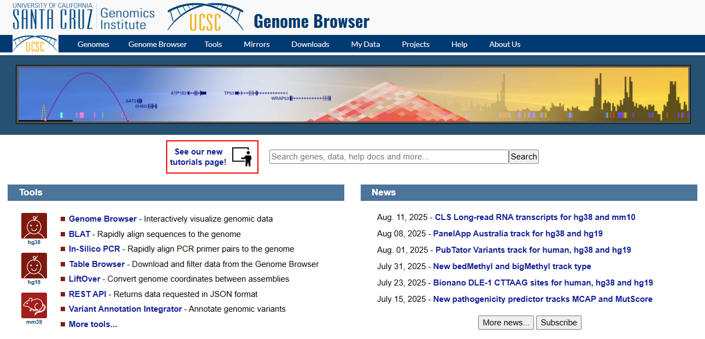
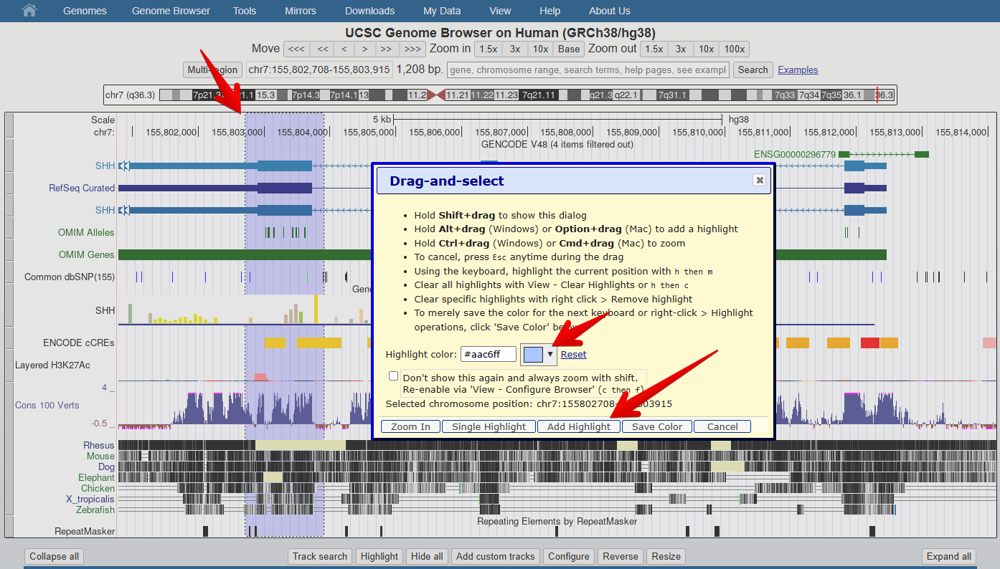

:::::::::::::::::::::::::::::::::::::: questions 

- How do we navigate the web interface of the UCSC genome browser?

::::::::::::::::::::::::::::::::::::::::::::::::

::::::::::::::::::::::::::::::::::::: objectives

- Become familiar with the basic features of the UCSC genome browser

::::::::::::::::::::::::::::::::::::::::::::::::

## Navigating the UCSC browser

Many of the tools that we will explore in this section can be selected via multiple different routes within the browser interface:

- Many tools can be accessed via the top toolbar on a pull down list
- Other tools can be accessed from within the browser window

In the following instructions, we will mostly navigate through successive 
lower levels from the pull down menu from the top toolbar. An
example of the notation used in this workshop: the below indicates that you should select <ins>Genome Browser</ins> 
from the top tool bar and then click on <ins>Reset all user settings</ins>.

`Toolbar   &nbsp;&nbsp; >   &nbsp;&nbsp; Genome Browser  &nbsp;&nbsp; >   &nbsp;&nbsp; Reset all user settings`

::: spoiler
## FURTHER HELP AND TRAINING

The UCSC Genome Browser is supported by a rich training resource which has 
new material added regularly to the [YouTube channel](https://www.youtube.com/channel/UCQnUJepyNOw0p8s2otX4RYQ/videos).

To access training and develop your skills further, go to: 

`Toolbar  &nbsp;&nbsp; >  &nbsp;&nbsp; Help  &nbsp;&nbsp; >  &nbsp;&nbsp; Training`

:::

 

::: caution
## WARNING

Weekly maintenance of the UCSC browser occurs at 2-3pm Sundays Pacific time 
(7-8am Mondays AEST / 8-9am Mondays AEDT). During this time the browser may be 
down for a few minutes. 

To ensure uninterrupted browser services for your research during UCSC server 
maintenance and power outages, bookmark one of the mirror sites that replicates the UCSC Genome Browser.

More information and contacts for the UCSC Genome Browser can be found [here](http://seabass.mpipz.mpg.de/contacts.html).
:::

## Setting up your browser

#### 1. Open the Browser interface

Navigate to the [UCSC Genome Browser](https://genome.ucsc.edu/) and [sign in](https://genome.ucsc.edu/cgi-bin/hgLogin?hgLogin.do.signupPage=1&returnto=https%3A%2F%2Fgenome.ucsc.edu%2Fcgi%2Dbin%2FhgSession%3Fhgsid%3D2907973544_r0PWRkU4aje0R8U2JQ1u6wewugzj) if you have an account.

 

#### 2. Reset the browser

To ensure we all see the same screen, select:

`Toolbar  >  Genome Browser  >  Reset all user settings`

 

#### 3. Select and open the human Genome Hg38 at the default position

::: tab

### Go directly to the genome

`Toolbar  >  Genomes  >  HumanGRCh38`

### ...or go to the Genome gateway page

`Toolbar  >  Genomes`

Ensure that GRCh38 is selected in ‘human assembly’ and click on the blue `GO` box

:::

 

#### 4. Familiarise yourself with the main areas of the interface

::: checklist

## Can you locate:

- The main Toolbar
- Blue bar track collections (data of similar types are collected together under the same ‘Blue bar’ heading). Scroll down to see additional data collections and which ones are turned on as default.
- Genome species and version number
- Position box
- Navigation tool buttons
- Chromosome ideogram
- Genome view window
- Pre loaded tracks, track titles:
  - The grey bars on the left of the genome view can be used for selecting and configuring the tracks.
  - You can change the order of the tracks by dragging these grey bars up and down.
- Turn tracks on and off:
  - You can hide tracks by right clicking on the grey bar or by turning them off in the Blue bar collections.
  - You have to click on a ‘refresh’ button for changes to be reflected in the genome view window.
- View the **configuration page** for one of the tracks. The configuration page gives you a lot of information about the data track and its colouring. You can open the configuration page for a track by:
  - clicking on the grey bar for the track or,
  - clicking on the track title in the Blue bar collection. More information and options are usually available by selecting the configuration page for a track via the track title in the Blue Bar collections.
- Select ‘resize’ button under the genome view to fit the genome view window to your screen

:::

 

#### 5. Customise your view

Use the ‘Configure’ tool to change the font size to 12

::: tab

### Method #1

`Toolbar  >  View  >  Configure browser  >  text size 12  > submit`

### Method #2

Click the `configure` button below the genome view window

Ensure that GRCh38 is selected in ‘human assembly’ and click on the blue `GO` box

:::

 

#### 6. Practice navigating around the genome view

::: checklist

## Can you practise:

- Moving left and right, using both the navigation buttons and your mouse
- Zooming in and out, using navigation buttons
- Zooming in to a region of interest, using `Drag-and-select`:
  - Using your mouse select a region of interest by clicking the ruler (position track) at the very top of the genome view window.
  - This is also how to access the *highlight tool* which you will use in a later exercise to highlight a region of interest.
    - Click on the down arrow next to the highlight colour to select a different colour.

:::

::::::::::::::::::::::::::::::::::::: keypoints 

- The UCSC genome browser can be easily configured according to your visual preferences and data needs

::::::::::::::::::::::::::::::::::::::::::::::::

