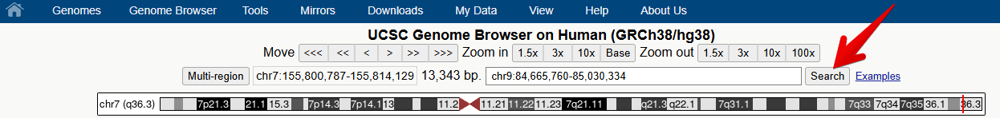

:::::::::::::::::::::::::::::::::::::: questions 

- How do we interpret gene models represented in the UCSC genome browser?

::::::::::::::::::::::::::::::::::::::::::::::::

::::::::::::::::::::::::::::::::::::: objectives

- Understand how genomic data is represented in the UCSC genome browser
- Identify differences between transcript variants

::::::::::::::::::::::::::::::::::::::::::::::::

 

Now we will explore some tools and public datasets available in the UCSC genome browser.

## Gene model representation

## NTRK2

First we are going to familiarise ourselves with the gene model representation of the different transcripts of *NTRK2*.

 

#### 1. Navigate to the NTRK2 gene position in GRCh38 and view the gene models. 

You can navigate to a different region of the genome by typing in the position box.

::: tab

### Genomic location

If you know the specific location you are interested in, type in the location (e.g. **chr9:84,665,760-85,030,334**)

### Gene name

If you have a gene of interest, you can type in the gene name (e.g. **NTRK2**). 

Note the autocompleted suggestions that appear when you start typing. 
You can select from one of the suggestions or click `go` and select from a wider range of options.

:::

 

#### 2. Hide all tracks 

Select the `Hide all` button below the genome view.

 

#### 3. Turn on the Gencode track

From the blue bar group labelled `Genes and Gene predictions`, set `GENCODE V48` to `full` 
and select `Refresh` to turn on the gene modelling track. 
*Note: the version number 48 may have changed since this workshop was last updated.*

 

#### 4. Turn on the Conservation track

From the blue bar group labelled `Comparative Genomics`, set `UCSC 100 Vertebrates` to `full` 
and select `Refresh` to turn on the conservation track. 

 

#### 5. Zoom out and scroll across the whole gene

Zoom out until you can view all of the 
5’ UTRs and 3’ UTRs for all transcript variants for this gene. Then drag the view 
left and right to centre the transcripts or use `drag-and-select` to `Zoom In`.

:::::::::: challenge

## CHALLENGE 1

Which strand is the gene encoded on / transcribed from? (+ or - strand)

::: solution

## Solution

The positive (+) strand. We know this because we can see the right-facing arrow ticks in the intronic regions of the gene model.

:::

## CHALLENGE 2

Identify the exons, introns and UTRs.

Do regions of conservation only occur were there are coding regions?

::: solution

## Solution

Compare the NTRK2 transcript tracks to the gene model representation at the top of this lesson
and discuss with your neighbour to identify exons, introns and UTRs.

Peaks in the conservation track indicate regions of high conservation across species. 
Use `drag-and-select` to zoom in to some non-exonic regions of high conservation 
(you may need to drag and select multiple times to zoom in far enough).

:::

## CHALLENGE 3

How many different transcripts variants are there for this gene?

How do they differ?

::: solution

## Solution

Count the number of items in the GENCODE track. Hover over each transcript to view its ID. 
You may also wish to turn on the `NCBI RefSeq` track to view the NCBI RefSeq transcript IDs.

Notice how the number and position of exons, introns, and gene length differ between transcripts.

:::

## CHALLENGE 4

Select a coding region/exon towards the 3’UTR of the gene. 
Zoom in to the region until you can see the letters of the amino acid sequence.
Then do the same for a coding region/exon towards the end of the 5’UTR of the gene. 

Why are some amino acid boxes red or green?

::: solution

## Solution

Green boxes indicate potential start codons, red boxes indicate translation termination codons.

:::

## CHALLENGE 5

Zoom in further until you can see each amino acid number.

Why do different transcripts have different amino acid numbers?

::: solution

## Solution

Different transcripts may have different exons, or exons of different lengths, 
so as you move further towards the end of the gene, the amino acid numbers between different 
transcripts may no longer match.

:::
:::::::::::::::::::::::::::::::::

::: callout

## NOTE

Note that one of the transcript names is highlighted in a different colour: 
this is the transcript you selected from the autocompleted list or the search results.

:::

 

#### 6. Change the view settings for the track 

Right click on the track grey bar in the left of the genome window to access view settings. 

Switch between  `dense` ,  `squish` ,  `pack` ,  and  `full`  to see how it changes the representation of the models.

 

#### 7. Reveal the Ensembl ID for each transcript

a. Right click on the GENCODE track grey bar and select `Configure GENCODE v48` to go to the configuration page.

b. Check the box to also reveal the `Ensembl ID` in the label.

c. Select `Apply` to save your changes.

The transcript names are now too long to fit on the screen. You can use the 
configuration page (like you did to change the font size earlier) 
to change the number of characters in the `Label area width` so that you can see the entire transcript label.

 

## Check your understanding

::::::::::::::::::::: challenge 

## Question 1

Which transcript encodes the shortest amino acid sequence?

::: solution 

## Answer

**ENST00000352327.5**

This transcript does not include one of the large coding regions and the coding region in the terminal exon is also slightly shorter.

:::

## Question 2

Which transcript has the longest 3'UTR?

::: solution 

## Answer

**ENST00000396976.6**

Although the last two exons of ENST00000396972.2 are UTR rather than coding sequence, 
it is still not as long as the 3'UTR of ENST00000396976.6

:::

## Question 3

Which transcripts appear to encode the same protein product?

::: solution 

## Answer

**ENST00000420986.6, ENST00000280352.13 and ENST00000393047.8**

Notice the height of the boxes for the first three exons: ENST00000532163.5 
appears to encode a different CDS from the other transcripts.

:::

## Question 4

Which transcript has the longest 5'UTR?

::: solution 

## Answer

**ENST00000532681.5**

This transcript is encoded on the reverse strand.

:::

## Question 5

Which transcript has the longest CDS?

::: solution 

## Answer

**ENST00000253801.7**

This transcript is encoded on the forward strand.

:::

## Question 6

Which transcript has the longest 5'UTR?

::: solution 

## Answer

**ENST00000589334.5**

This transcript is encoded on the reverse strand.

:::
::::::::::::::::::::::::::::::::::::::::::::::::

## BDNF

Now we will look at the gene model for BDNF in the same genome. 
There are some differences that enable us to demonstrate some more tools.

 

#### 1. Navigate to the BDNF gene position in GRCh38

- Note that there are blue transcript models encoded on the - strand and green 
*BDNS-AS* transcript models on the + strand. *BDNF-AS* is the antisense gene.
- Colouring information is specific for each track and can be obtained from the configuration page. 
Below is the colouring legend for the GENCODE V36 track.

 

#### 2. Flip the orientation of the gene

Since the convention is to display genes in the 5’ to 3’ orientation, 
it can be useful for our own interpretation, and also for presentation purposes, 
to flip the orientation of a gene when viewing it in a Genome Browser.

To flip the orientation of the gene, use the `reverse` button under the genome view window.

 

#### 3. Apply the Multi-Region view from the main tool bar view options

When a gene has many large introns taking up a lot of white space in an image, 
it can be difficult to see if exons in different transcript models or other data tracks align. 
The **Multi-Region** view tool can be used to fold the intronic regions out of the view like a concertina. 
The Broswer selects which region to fold out based on the gene model track(s) that you have turned on at the time.

`Toolbar  >  View  >  Multi-Region  >   Show exons using GENCODE V48  >  Submit`

::: callout

## Did you notice?

- The transcript variants for the *BDNF* gene vary mostly in the genomic position of the 5’UTR.
- The noncoding *BDNF-AS* gene transcript includes a region that would be antisense to the coding BDNF transcript.

:::

You may find that using the multi-region tool facilitates visualisation and 
interpretation of gene expression data later in the workshop.

 

::::::::::::::::::::::::::::::::::::: keypoints 

- The UCSC genome browser graphically represents key elements of gene transcripts, 
including exons, introns, and untranslated regions
- Different settings and tools can be used to configure the browser to more easily investigate specific features of a gene.

::::::::::::::::::::::::::::::::::::::::::::::::
