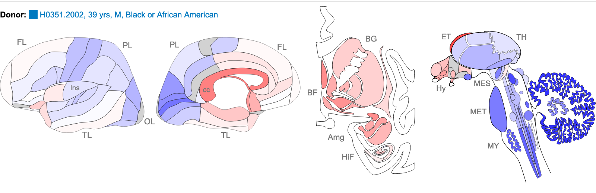

:::::::::::::::::::::::::::::::::::::: questions 

- What is the BLAT tool and how do we use it?

::::::::::::::::::::::::::::::::::::::::::::::::

::::::::::::::::::::::::::::::::::::: objectives

- Use the UCSC BLAT tool to compare the similarity of a short probe sequence to the 
human genome and identify the genomic transcript each probe is most likely to detect.

-   Understand the how some types of genomic and expression data are represented in genome browsers
-   Determine the tissue/cell type expression profiles of a gene of interest in mouse and human expression data
-   Know some basic files types used in genome browsers and upload and view local BAM files.
-   Use the BLAT tool to locate genomic regions with similarity to a sequence of interest
-   Create custom interactive views with multiple datatypes to share with colleagues and generate images for publications
::::::::::::::::::::::::::::::::::::::::::::::::

## The BLAT tool

The [BLAT tool](https://genome.ucsc.edu/FAQ/FAQblat.html) is a sequence similarity 
tool similar to BLAST. It can quickly identify region(s) of homology between a genome 
and a sequence of interest. Due to the presence of orthologs and paralogs, a target sequence 
may have similarity to more than one region in the genome. 

## A note on microarray expression data

Microarray expression data is not commonly used now, but some of the data generated from 
large, well-orchestrated studies still provide valuable information to researchers. 
Microarray probes, like *in situ* hybridisation probes, target a small region of the RNA 
and do not measure the whole RNA transcript. If you are measuring gene expression, it is 
important to know exactly which region of the gene you are detecting. 

## Exercise

In this exercise, we will employ the BLAT tool to map the sequences of two different expression probes 
to their target regions and determine which NTRK2 gene transcripts the probes are likely to detect.

The study was the [Human Brain gene expression atlas](http://human.brain-map.org/) 
generated by the [Allen Institute](https://alleninstitute.org/about/). 
Below are sequences of two hybridisation probes that were use in a microarray 
used to detect expression of the gene NTRK2. These two probes result in very different 
hybridisation and expression patterns across different regions of the brain. 
As we observed in the previous exercise, NTRK2 has a number of different transcript variants. 

> **Our question: are these probes are detecting different or multiple transcripts of NTRK2, and if yes, which ones?**

### The probes

The images below are of one of the six donors included in the atlas, and typical 
of the expression pattern for NTRK2. These images are taken from the 
[NTRK2 gene page of Human Brain Atlas](http://human.brain-map.org/microarray/gene/show/4884).

Most obvious in the images is the high level of expression signal using Probe A_23_P216779 
and low level for A_24_P343559 in the corpus callosum (CC), which is a region of white matter 
in the brain with relatively few neurons and relatively high proportion of myelinating oligodendrocytes. 
This expression profile is reversed in the the cortical regions, eg. frontal lobe (FL) and parietal lobe (PL), 
which have a relatively high density of neuronal cells.

#### NTRK2 Probe A_23_P216779

**Sequence:** TTCTATACTCTAATCAGCACTGAATTCAGAGGGTTTGACTTTTTCATCTATAACACAGTG

#### NTRK2 Probe A_24_P343559 

**Sequence:** AAGCTGCTCTCCTTCACTCTGACAGTATTAACATCAAAGACTCCGAGAAGCTCTCGAGGG

### Your task

#### 1. Use the BLAT tool to find region of homology

a. Select  `  Toolbar  >  tools   >  blat`

b. Copy the sequence of the first probe above and paste into the search box

c. Select the human GRCh38 for ‘Assembly’ and click  `  Submit  `
  
  Probe A_23_P216779 returns 2 hits for different chromosomes. 
  One of these has 100% homology over the whole 60 base sequence, 
  the other has 87% homology over a 24 base region.
  
d. Copy and paste the probe name to use as the label for the **Custom track name** and **Custom track description** 
and click on  `  Build a custom track with these results  `  . 
It is not necessary to build a custom track - you could simply click on 
the  `  browser  `  link to view the results, but creating a ‘custom track’ from 
the BLAT result enables you to give it a unique name. This is important if you 
are doing multiple BLAT searches as you wont be able to tell which one is which.

e. Select  `  browser  `  option for the hit with the highest homology to view the result. 
Observe which region of the NTRK2 gene this probe will target. Zoom out for context.

f. Note that a new **Blue bar** heading has appeared for your custom tracks.

g. Repeat for the other probe sequence.

#### 2. Use the ‘highlight’ tool to keep track of region of interest in the Genome view.

a. It is easy to lose track of a region you are investigating when navigating around the 
genome in a browser. We are going to highlight each region of probe homology within the NTRK2 gene, 
using a different colour for each probe. Highlight is also useful if you have lots of different tracks 
loaded and you want to check that a feature on one track lines up with another.

b. Using your mouse, select in the position track at the top to activate **Drag-and-select**. 
Select only the region of homology for each probe within the NTRK2 gene and use a different highlight for each region. 

c. Zoom out to view the whole gene again.

::: challenge

Do the probes detect coding regions of the NTRK2 gene?

:::

::: challenge

Are the probes likely to detect different transcripts?

:::

#### 3. Use ‘Multiregion view’ to make it easier to compare coding regions of different transcripts

`Toolbar  >  View  >  Multi-Region  `  select  `  Show exons using GENCODE V36  `

>
> We have created a ‘public session’ of the BLAT NTRK2 exercise. You can view this from the link in the sessions.
>
> ` Toolbar  >  My data   >  Public session  >  `  search for **hg38_NTRK2_blat_probes**
>

::::::::::::::::::::::::::::::::::::: keypoints 

- We can use the UCSC [BLAT tool](https://genome.ucsc.edu/FAQ/FAQblat.html) to 
identify region(s) of similarity between a sequence of interest and other parts of the genome.

::::::::::::::::::::::::::::::::::::::::::::::::

