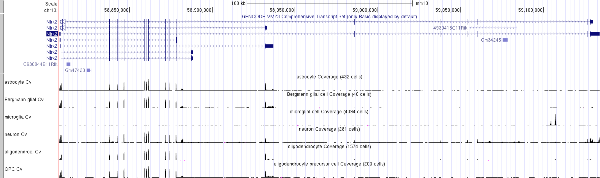

:::::::::::::::::::::::::::::::::::::: questions 

- How can we explore gene expression data in the UCSC genome browser?

::::::::::::::::::::::::::::::::::::::::::::::::

::::::::::::::::::::::::::::::::::::: objectives

Use the UCSC gene browser to:

- Interpret gene expression data from multiple sources
- Compare a region of one genome to genomes of other species

::::::::::::::::::::::::::::::::::::::::::::::::

## GTEX data

Human tissue specific expression data from the [GTEX project](https://gtexportal.org/home/) 
is available in the UCSC genome browser.

- Gene level expression data from GTEx V6 (570) donors, and GTEx V8 (948) donors 
can be turned on from Blue bar title for more detailed configuration page. These are displayed as coloured bar plots.
- Transcript level data is also available for GTEx V6, this is also displayed as bar plots.
- Transcript level expression data for GTEx V6 is available as coverage plots and is accessed from the **Track hubs**.
  - Under the genome view window, click on the `track hubs`,  or access from the `Toolbar` under `My data`
  - Scroll down and select `GTEx RNA-seq Signal Hub`. This can be viewed in either hg19 or hg38 
  so can be compared with a wide variety of other datasets.
  
  
  
Default settings:

- All the available data from one individual only is loaded. Data from other subjects 
in the study can be loaded as desired. For example, you could load all available samples for one tissue region only.
- The data is *autoscale to data view* with a track height or 12 pixels for each samples. 
You can change the height of the track or add a data transformation.
- The default points plot can be converted into a density plot by clicking on the track title.

  
  
### Your task

Using the selection matrix for female donors aged 2-49 years, deselect the default samples 
and select only Brain cortex and Pancreas samples. 

Navigate to the location for the gene MYRF. You can increase the height of the datatrack to improve visualisation.

::: challenge

## CHALLENGE 1

Can you locate an exon in the MYRF gene that is present in transcripts expressed in the brain but not in the pancreas?

:::

::: challenge

## CHALLENGE 2

Does this alternative splicing event result in a frame shift of the coding sequence?

:::

::: challenge

## CHALLENGE 3

How many amino acids are there in the protein products for each MYRF transcript?

:::

## FACS data

The FACS derived data from the [Tabular Muris](https://tabula-muris.ds.czbiohub.org/) cell type data can be visualised as a coverage plot

### Your task

1. Start at the view of the NTRK2 gene in the human genome and navigate to the Ntrk2 gene in the mouse genome using the **View in other genomes tool**.

  `Toolbar  >  View  >  In Other Genomes  ` (Convert)
  
2. Select `New Genome:Mouse`, `New Assembly:GRC38/mm10`, click on `Submit`

3. Select the region with the greatest homology

4. Click on the bar chart icon for the Tabular muris data in the default view to see a summary bar chart of the cell type data.

5. To see a coverage plot of the expression data, we have to configure the Tabular Muris track by selecting it from the blue bar collection.
    a. Hide `Cell expression`
    b. Select `Genome coverage` to full
    c. Select `submit`
  
  *This can look a bit overwhelming as there are many tracks and the default track height is set very high. *
  *But it is easy to simplify it by focusing on a few cell types of interest.*

6. Right click on the grey bar to `configure the track set`
    a. Change `Track height` to 30
    b. for `Data view scaling` select `group auto-scale`
    c. clear all the subtracks and then manually select only these few cell types of interest:
    
      - astrocyte Cv
      - Bergmann glial Cv
      - microglia Cv
      - neuron Cv
      - oligodendrocyte Cv
      - OPC Cv

::: challenge

## CHALLENGE 4

Which cell type has the highest level expression of Ntrk2 in this dataset?

:::

7. Change the `Data view scaling` from autoscale to dataview.

8. Export a PDF image of the genome view:  `Toolbar  >  View  >  PDF/PS  `  select  `Download the current browser graphic in PDF`
  
  
  
::: challenge

## CHALLENGE 5

Which cell type(s) express the long and short transcripts of Ntrk2?

:::

## Linnarsson lab data

Mouse CNS cell type expression data can also be validated using an independent single cell 
dataset of mouse cortex from the [Linnarsson lab](http://linnarssonlab.org/).

The data that is publicly available for viewing in the UCCS genome browser is not housed in the UCSC genome browser. 
You must first access it from the the Linnarsson lab data page.

This RNAseq data is stranded, meaning you can see if the transcript data is from the + or - strand.

### Your task

1. Click [here](http://linnarssonlab.org/cortex/) for the Linnarsson lab public data page for this dataset where you can search for cell expression profiles for individual genes.

2. Click on the `Browse the genome` blue text near the bottom of the page.
  
  This loads 18 different tracks, one for each cell type investigated. The default setting 
  for expression range is quite high and most gene expression is not observed with these settings. 
  Each track must be configured individually rather than as a group, which takes a lot of time. 
  
We have created a version of this data as a public session in the UCSC genome browser, where each track is 
autoscaled which can make it quicker to determine which expression range would be ideal for visualising 
the expression of an individual gene. The data is also viewed using ‘Multi-Region’ which hides the introns in the gene models. 
The session is illustrated in the screen shot below and you can access this custom track set by 
clicking on the title in blue text. It is also a publicly shared session called **mm10 Linnarsson Celltype autoscale** 
which you can access from the database of public sessions.
  
](episodes/fig/06geneexpression_linnarsson_ntrk2.png)

::: challenge

## CHALLENGE 6

Select two or three cell types and adjust the scale to best reflect differences in gene expression of Ntrk2 between these cells. 

Save this session and share it.

:::

::::::::::::::::::::::::::::::::::::: keypoints 

- The UCSC genome browser allows you to compare gene expression data from multiple sources and different species
- You should now be confident using the UCSC genome browser to:
  - View your own data in context of other annotations
  - Compare a region of one genome to genomes of other species

::::::::::::::::::::::::::::::::::::::::::::::::

