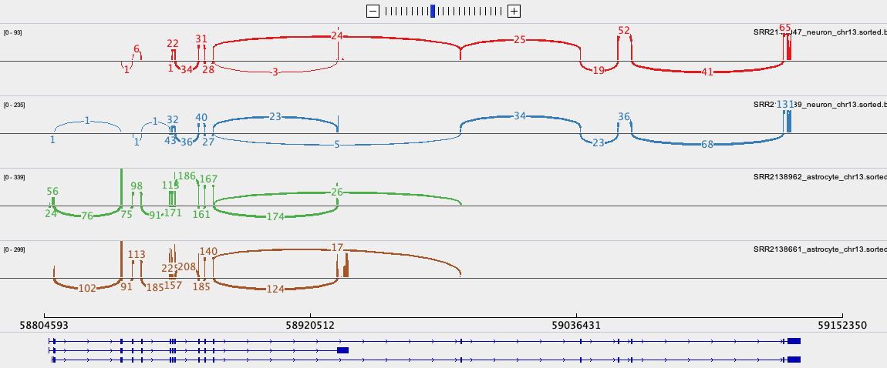

:::::::::::::::::::::::::::::::::::::: questions 

- How do you use IGV?

::::::::::::::::::::::::::::::::::::::::::::::::

::::::::::::::::::::::::::::::::::::: objectives

- Learn how to open files and navigate IGV
- Understand the type of data that can be visualised in IGV

::::::::::::::::::::::::::::::::::::::::::::::::

## IGV

In this section we will download a BAM file of gene expression data from SRA, 
and view it in the **Integrated Genome Viewer (IGV)**. BAM files must first be sorted 
and indexed before they can be loaded into genome viewers. 
IGV has tools to do this without having to use the command line.

## Exercise

### The data

The expression data we are using for this exercise is from the 
mouse [Celltax single cell expression atlas](http://casestudies.brain-map.org/celltax) published 
by the Allen Brain Institute. The cell tax vignette has an expression browser that displays 
gene level expression as a heat map for any gene of interest. 
The readsets (fastq files) and aligned data (BAM files) for 1809 runs 
on single cells are also available for download from SRA.

The SRA study ID for this study is [SRP061902](https://www.ncbi.nlm.nih.gov/sra?term=SRP061902) and
individual runs from this study are easily selected by viewing the samples in the ‘RunSelector’. 

For this exercise, we will download a few samples in order to illustrate navigating in IGV 
by looking at the expression of NTRK2 in the same cell types we have discussed in earlier exercises.
For each cell type, we will down load a .BAM file containing only the reads from the chromosome of interest.

### Your task

#### 1. Download BAM files from SRA

For each SRA run in the table below:

| Cell type     | SRA run                                                                         | Vignette Cell ID    |
| ------        | --------                                                                        | -------             |
| astrocyte     | [SRR2138962](https://trace.ncbi.nlm.nih.gov/Traces/sra/sra.cgi?run=SRR2138962)  | D1319_V             |
| astrocyte     | [SRR2139935](https://trace.ncbi.nlm.nih.gov/Traces/sra/sra.cgi?run=SRR2139935)  | A1643_VL            |
| neuron        | [SRR2139989](https://trace.ncbi.nlm.nih.gov/Traces/sra/sra.cgi?run=SRR2139989)  | S467_V4             |
| neuron        | [SRR2140047](https://trace.ncbi.nlm.nih.gov/Traces/sra/sra.cgi?run=SRR2140047)  | S1282_V             |

a. Click on the SRA run to open the link.

b. Click on the ‘Alignment’ tab. Note that the data is aligned to the mouse GRCm38 genome (mm10).

c. Select the chromosome of interest. For NTRK2 in mouse it is chr13

d. For ‘Output this run in:’ select **BAM** and click on ‘format to:’ **File**

e. Rename the downloaded file to include the cell type, to avoid confusion, e.g. *SRR2138661_astrocyte_chr13.bam*

#### 2. Use IGV tools to SORT and INDEX the BAM files 

a. Open IGV and select  `  Tools  >  Run igvtools  `  from the pull down menus

b. Select  `  Sort  `  from the Command options and use the browse options to select 
the BAM file you just downloaded. Click  `  Run  `

c. Without closing the igvtools window, now select the command  `  Index  `   and browse to 
find the BAM file you just sorted. It will have the same file name with ‘sorted’ added to the 
end, e.g. *SRR2138661_astrocyte_chr13.sorted.bam*

The resulting index file will have the file name *SRR2138661_astrocyte_chr13.sorted.bam.bai*

::: callout

## IMPORTANT

It is essential that the index file for a BAM file has the **same name** and is located 
in the **same folder** as its BAM file. If not, the IVG software will not be able to open the BAM file.

:::

#### 3. View the BAM files in IGV

a. Select the Mouse (mm10) genome from the genome box in the top right hand corner.

b. Select `  File  >  Load from File  `  and select all four *\_chr13.sorted.bam* files only

c. Select  `  open  `  - but don’t expect to see any data yet. The genome view window opens 
on a whole chromosome view as default but it wont show any data until the view region is 
small enough to show all data in the current view.

d. Type the gene name ‘NTRK2’ into the search window.

e. Expand the Refseq gene model track by right clicking it to see all the splice variants

f. The gene and thus the genome view is 328kb and the default setting for viewing data is only 100kb. 
Unless you have already changed your settings, alignment data will not get be showing. Zoom into 
the region of a coding exon by selecting in the numbered location track at the top of the genome view.

      To see the whole gene in the genome window at the same time you may need to change the preferences.

g. Go to `  View  >  Preferences  `  and select the  `  Alignments tab  `. Change the visibility range threshold to 400kb.

#### 4. Export images

a. The Genome view above can be exported by selecting  `  File  >  Save image  `  from the tool bar

b. To export the Sashimi plot below:
  
    i. Right click on one of the junction tracks and select  `  Sashimi Plot  `  from the pull down menu.
    ii. Select the tracks you want in your final image.
    iii. There are some data filtering and style adjustments you can make to the Sashimi plot. 
    Right click on each track to access the menu options. 
    Some changes apply to each track individually and some to all tracks.
    

#### 5. Download and install the Gencode gene model annotation track

The refseq gene model track is not as comprehensive as GenCode gene models. 
For both Human and Mouse the Gencode gene model gtf annotation files can be downloaded 
from [Gencode](https://www.gencodegenes.org/mouse/). 
If you wish to do this be aware that it takes a little time and is not done as part of a workshop.

a. Create a folder called ‘annotations/Mouse’ in the main ‘igv’ folder that was 
installed on your computer when you downloaded IGV.

b. Download the GTF file from the link above and save it in this folder.

c. Unpack and then **sort** and **index** the .gtf file using igvtools.

d. In IGV, before you load you data files, load this annotation file and it will replace the refseq one.

::: spoiler

## FURTHER READING

If you would like to learn more about how to use IGV, please go to:

https://rockefelleruniversity.github.io/IGV_course/presentations/singlepage/IGV.html

:::

::::::::::::::::::::::::::::::::::::: keypoints 

- IGV can sort and index BAM files without use of the command line
- Sorted and indexed BAM files can then be opened to view genomic sequencing and gene expression data in IGV

::::::::::::::::::::::::::::::::::::::::::::::::

