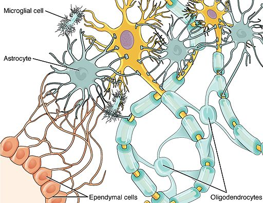

:::::::::::::::::::::::::::::::::::::: questions 

- What are genome browsers and why are they useful?
- What data are we using in this workshop to demonstrate the use of genome browser tools?

::::::::::::::::::::::::::::::::::::::::::::::::

::::::::::::::::::::::::::::::::::::: objectives

- Understand the utility of genome browsers 
- Describe the biological pathway that will be referenced throughout this tutorial

::::::::::::::::::::::::::::::::::::::::::::::::

## Introduction to genome browsers

Genome browsers are invaluable for 
**viewing and interpreting the many different types of data that can be anchored to genomic positions.** 
These include variation, transcription, 
the many types regulatory data such as methylation and transcription factor binding, 
and disease associations. The larger genome browsers serve as data archives for valuable 
public datasets facilitating **visualisation and analysis of different data types.** 
It is also possible to load your own data into some of the public genome browsers.

By enabling viewing of one type of data in the context of another, the use of Genome browsers 
can reveal important information about gene regulation in both normal development and disease, 
and assist hypothesis development relating to genotype phenotype relationships.

::: callout
### COMMONLY USED GENOME BROWSERS

All researchers are encouraged to become familiar with the use of some of the main browsers, such as:

- [The UCSC Genome Browser](https://genome.ucsc.edu/) (RRID:SCR_005780)
- [ESEMBL Genome Browser](https://www.ensembl.org/index.html) (RRID:SCR_013367)
- [Epigenome browser at WashU](https://epigenomegateway.wustl.edu/browser/) (RRID:SCR_006208)
- [Integrative Genomics Viewer (IGV)](http://software.broadinstitute.org/software/igv/) (RRID:SCR_011793)

:::

These browsers are designed for use by researchers without programming experience 
and the developers often provide extensive tutorials and cases studies demonstrating 
the myriad of ways in which data can be loaded and interpreted to assist in develop 
and supporting your research hypothesis.

Many large genomic projects also incorporate genome browsers into their web portals 
to enable users to easily search and view the data. These include:

- [GTEx](https://gtexportal.org/home/)
- [gnomAD](https://gnomad.broadinstitute.org/)

## The human reference genome

Genome browsers rely on a **common reference genome** for each species in order to map data 
from different sources to the correct location. A consortium has agreed on a common numbering 
for each position on the genome for each species. However, this position will vary based on 
the version of the genome, as error correction and updates can change the numbering. 
Therefore it is very important to know **which version of the genome your data of interest is aligned to.**

The sequence for the human reference genome was accumulated up over many years from sequence 
data from many different sources and does not represent the sequence of one single person. 
Instead it is a composite of fragments of the genome from many different people. Also, unlike 
the human genome which is diploid, the human reference genome is haploid. That is there is only 
one copy of each chromosome. It therefore does not reflect the variation on the population, or 
even the most common variants in the human genome. *Exploring variation within human genome is *
*very important and facilitated by genome browsers but not covered in this workshop.*

::: spoiler

## FURTHER READING

If you would like to learn more about genome build version number and updates, please go to:

- [The Genome reference consortium](https://www.ncbi.nlm.nih.gov/grc)
- [UCSC genome browser: What does the nomenclature mean?](https://genome.ucsc.edu/FAQ/FAQreleases.html)
- [UCSC genome browser: Updates and blog pages](https://genome.ucsc.edu/goldenPath/newsarch.html)

:::

## Introduction to the data used in this workshop

This tutorial uses the a well known and important signalling pathway in the central nervous system (CNS) 
to illustrate some of the genome browser tools and utility.

### BDNF and TrkB signalling

Brain Derived Neurotrophic factor (BDNF) protein is an important neurotrophin responsible for 
regulating many aspects of growth and development in different cells within the CNS. TrkB 
is an important receptor that binds extracellular BDNF and propagates the intracellular 
signalling response via a tyrosine kinase. This TrkB receptor protein is encoded by the NTRK2 gene.

The NRK2 gene expresses a number of different transcript variants in different cell types. 
The most well studied of these is the full length TrkB receptor referred to as TrkB, 
which is mainly expressed in neuronal cell types. The other transcript variants all 
express the same exons encoding the extracellular domain of the receptor 
(shown in the figure here in green) but have truncated intracellular domains, 
which do not include the tyrosine kinase domain and thus activate different signalling 
pathways upon binding to BDNF. None of these truncated protein products have been well studied, 
but the most highly expressed receptor variant is known as TrkB-T1, and is known to be highly expressed in astocytes.

Since the transcript variants are differently expressed in different cell types within the CNS, 
the NTRK2 gene is a very useful example for exploring cell type specific transcript expression in available public data.

### Major CNS cell types

- Neuron (yellow cell in the image)
- Astrocyte
- Oligodendrocyte
- Microglia
- Ependymal

